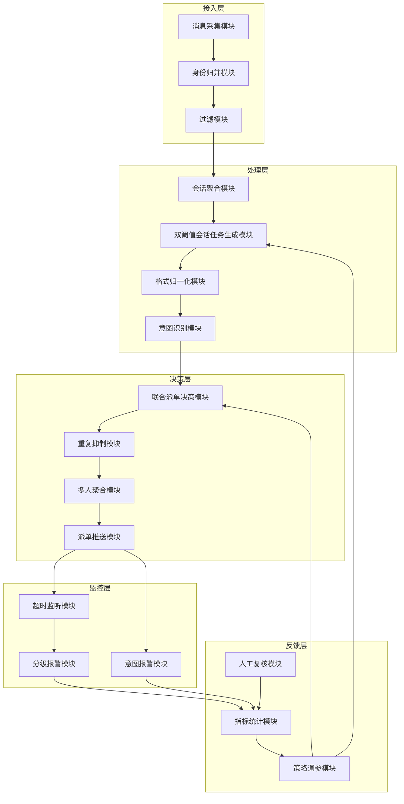
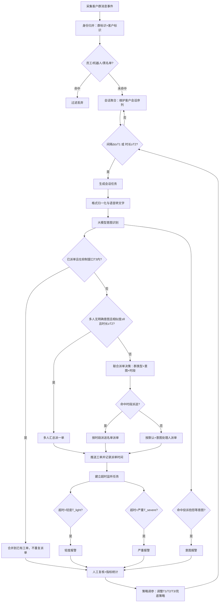

# 技术交底书

**案件名称**：一种面向企业即时通信客户群的智能会话派单与运营监控方法、系统、设备及存储介质

**技术联系人**：
- 姓名：[待填写]
- 电话：[待填写]
- 邮箱：[待填写]

**专利类型**：发明

---

## 注意事项

（1）交底书应使代理人能看懂，尤其是背景技术和详细技术方案，一定要写得全面、清楚、完整；
（2）技术的公开程度，应以本领域普通技术人员不需付出创造性劳动即可进行实施为准。
（3）在与代理人沟通时，对于代理人咨询的技术问题，应给予回答并认真讲解，并且按要求及时正确地补充相应技术材料。

---

## 一、技术背景与现有技术

### 1.1 现有技术

检索说明：在国家知识产权局专利公布公告系统及 Google Patents 中，以"企业客户群""群聊消息""会话切分""意图识别""工单生成""工单派单""超时报警""运营监控"等为检索词进行检索，并参考企业即时通信生态公开产品资料、智能客服与群聊对话理解方向的公开学术文献、美国专利局公开专利文本；部分条目的著录项与摘要以 Google Patents 页面复核。以下按技术方向分类说明。

#### 方向一：企业即时通信生态与会话存档运营平台

1. **企业微信（腾讯）**：面向企业的通信与办公工具，具备与微信互通、客户关系沉淀、开放 API 接入等能力，是企业客户群通信生态的基础设施。
   - 应用场景：企业内部办公与对外客户运营。
   - 局限性：仅提供通信与开放能力基础，不提供面向客户大群的服务诉求实时识别、会话任务切分、按意图派单与超时分级报警的行业化调度能力。
   - 来源链接：https://www.tencent.com/zh-cn/business/wecom.html

2. **微伴助手**：数字化运营管理平台，公开功能含会话内容存档、群 SOP、在线客服、企微工单、智能工单/预警工单、客户画像、AI 识别客户对话内容等。
   - 应用场景：私域获客、销售服务闭环、客户运营。
   - 局限性：覆盖广但偏私域运营与销售转化；未体现"同群同客户双阈值会话切分 + 大模型意图派单 + 轻度/严重超时分级报警 + 按时段派送 + 行业意图体系"的组合策略。
   - 来源链接：https://www.weibanzhushou.com/

3. **微盛·企微管家**：产品含 SCRM、微信客服、会话管家、聊天 Agent、AI 营销服务平台，强调会话存档与 AI 营销效率。
   - 应用场景：企业微信生态下的营销获客与会话辅助。
   - 局限性：偏 AI 营销与 SCRM 增长，未明确披露客户大群的会话窗口切分、漏单/多派约束、超时分级报警与按意图派单名单的组合方案。
   - 来源链接：https://www.wshoto.com/

4. **尘锋 SCRM**：SCRM、微客服、微商城、增长运营一站式私域方案，强调售前咨询、销售转化、交易管理。
   - 应用场景：私域获客、转化与交易管理。
   - 局限性：偏获客、转化、交易运营服务；未突出"大群客户诉求实时识别派单"与"售后响应超时质检报警"。
   - 来源链接：https://www.dustess.com/

#### 方向二：群聊消息到工单的直接转化（最接近的专利技术）

5. **CN116032871B（已授权）——基于聊天消息创建工单的方法、装置和设备**：获取客户群中的群消息数据，自动判断是否需要针对群消息创建工单，若需要则根据群消息数据生成工单数据并发送至工单系统，实现群聊消息到工单的自动转化。该专利是本领域已授权的直接竞品，公开了"群消息→工单生成"的基础链路，但未公开双阈值会话任务生成（`T₁` + `T₂`）、重复抑制窗口（`T₃`）、多人聚合按相似度 `θ` 汇总派单、群类型/意图/时段联合派单、超时分级与意图报警并行、准确率/漏单率/多派率闭环优化。
   - 应用场景：通信软件中客户群消息监测与自动工单。
   - 局限性：仅解决"是否需要创建工单"的判断与发单，不涉及会话窗口切分、抑制、聚合、联合决策派单、分级监控与闭环。
   - 来源链接：https://patents.google.com/patent/CN116032871B/zh

6. **CN122226741A（在审）——基于群消息上下文感知的智能数据抽取与任务生成系统及方法**：含四层架构（客户端/网关/AI 服务/大模型交互），从群消息中自动进行上下文感知、数据抽取与任务（工单）生成，侧重消息流到数据资产和行动项的智能化转化。
   - 应用场景：即时通信群消息的智能处理与任务生成。
   - 局限性：聚焦数据抽取与任务生成层，不公开双阈值会话任务生成、重复抑制窗口、群/意图/时段联合派单及超时分级报警/闭环。
   - 来源链接：https://patents.google.com/patent/CN122226741A/zh

7. **CN120434222A（在审）——基于大模型的群消息处理方法、装置及存储介质**：利用 UI Automation 监听目标群消息，通过大模型进行意图分析确定消息意图类型，根据意图类型自动路由到对应处理流程与方案文档管理。
   - 应用场景：面向设计/工程协作群的群消息自动处理。
   - 局限性：通过 UI 自动化而非平台 API 接入，仅做到"意图→工作流路由"，不涉及会话任务生成（双阈值）、重复抑制、联合决策派单、分级监控与闭环。
   - 来源链接：https://patents.google.com/patent/CN120434222A/zh

8. **CN121814728A（在审）——基于企业微信会话存档的客户会话分配与提醒方法及系统（字节流科技）**：自动检测新增会话，结合排班与预设规则智能分配会话，内置超时检测并在超时后生成提醒。
   - 应用场景：企业微信生态下的客户会话分配与提醒。
   - 局限性：仅做到"分配 + 单级超时提醒"，无意图驱动的派单决策、无分级报警与意图报警并行、无派单与监控解耦、无漏单/多派/准确率闭环。
   - 来源链接：https://patents.google.com/patent/CN121814728A/zh

#### 方向三：群聊意图识别与任务自动派生

9. **CN121480730A（在审）——面向群体会话的意图识别与任务自动派生方法**：构建多层动态因果网络对群体会话进行深层意图识别，执行因果路径溯源与条件性反事实仿真验证，自动派生任务集并生成完整性评分，迭代修复直至通过完整性验证，实现"意图识别→任务（工单）自动派生"的闭环。
   - 应用场景：群体会话的意图识别与任务自动生成。
   - 局限性：核心在因果网络推理与反事实验证，技术路线不同；不公开双阈值会话切分、重复抑制 `T₃`、群/意图/时段联合派单、超时分级与意图报警并行、指标闭环。
   - 来源链接：https://patents.google.com/patent/CN121480730A/zh

10. **US20200250277A1（IBM）——通过将发言分类为产品、意图和聚类来分析聊天记录数据**：将聊天记录（含群聊）中的发言按意图/产品/聚类进行分类并提取代表发言，以辅助路由和支持。
    - 应用场景：聊天记录自动分类与辅助路由。
    - 局限性：侧重离线分类与聚类分析，不构成实时派单调度系统，无会话任务生成、抑制、监控与闭环。
    - 来源链接：https://patents.google.com/patent/US20200250277A1/en

#### 方向四：客服会话切分与工单摘要/生成

11. **CN112686674A（科讯嘉联）——客服会话工单摘要方法**：按业务场景和主题边界对会话内容进行主题拆解（会话切分），判断主题类别后调用对应槽位提取模型获取工单槽位元素信息，整合输出工单摘要。
    - 应用场景：电话/在线客服会话的工单摘要。
    - 局限性：面向离线摘要生成，不涉及实时双阈值会话任务生成服务于动态派单、不涉及重复抑制窗口、多人聚合、联合派单决策、监控报警与闭环。
    - 来源链接：https://patents.google.com/patent/CN112686674A/zh

12. **CN122001842A（在审，柒贰零健康科技）——基于联系人式企业通信的智能客服实时辅助系统**：含意图识别模块（输出业务意图、子意图及实体信息）与工单生成模块（自动生成预填工单并统计客服指标）。
    - 应用场景：企业通信中的客服实时辅助与工单生成。
    - 局限性：面向一对一联系人式通信，非客户大群多人场景；无群聊会话切分、无多人聚合、无群/意图/时段联合派单、无分级报警与闭环。
    - 来源链接：https://patents.google.com/patent/CN122001842A/zh

13. **AliMe Assist（阿里）**：面向大规模客户服务的智能客服系统，基于问答、语音/文本输入、上下文与多轮交互服务客户问题。
    - 应用场景：电商等大规模在线客服问答。
    - 局限性：一对一问答与多轮对话为主，未针对"多人交叉发言的客户大群"做会话切分与派单调度，未涉及超时分级报警与漏单/多派闭环。
    - 来源链接：https://arxiv.org/abs/1801.05032

14. **ISPY**：针对社区实时聊天（直播/群聊）中的问题-解决方案抽取研究，先拆分对话、检测问题、再提取解决方案。
    - 应用场景：直播/社区群聊的信息抽取与知识沉淀。
    - 局限性：离线信息抽取，未与实时派单调度、超时运营监控、漏单/多派指标反馈结合，不构成端到端服务调度方法。
    - 来源链接：https://arxiv.org/abs/2109.07055

#### 方向五：基于智能体的群协作与意图驱动方法

15. **CN121509376A（用友网络）——基于智能体的即时通讯群组协作方法**：为超级群自动绑定数智员工（AI Agent）作为群助理，对群内消息进行实时意图分析，识别业务意图后以业务卡片形式在群内交互，实现"沟通—业务—智能"融合。
    - 应用场景：企业超群的智能 Agent 辅助协作。
    - 局限性：AI Agent + 卡片交互模式，非"会话切分→派单调度→运营监控"系统；无双阈值、抑制、联合派单、分级监控与闭环。
    - 来源链接：https://patents.google.com/patent/CN121509376A/zh

16. **US20240112196A1——求助意图分类与工单生成的 Issue 管理系统**：处理社交媒体与聊天消息中的求助意图，超过阈值后自动生成 ticket 并派发至 Issue 跟踪系统；含特征化、分段与 Webhook 监控。
    - 应用场景：社交媒体/聊天的求助意图检测与工单派发。
    - 局限性：单通道求助检测，非群聊多人场景；无会话切分双阈值、无重复抑制与多人聚合、无超时分级、无闭环。
    - 来源链接：https://patents.google.com/patent/US20240112196A1/en

**相似专利差异对比表**

| 维度 | 本方案 | CN116032871B （已授权） | CN121480730A | CN122226741A | CN121814728A | CN112686674A | CN120434222A | CN122001842A | CN121509376A | US20240112196A1 |
|---|---|---|---|---|---|---|---|---|---|---|
| 群聊→工单 | ✓ | ✓ | △ | ✓ | △ | — | — | — | △ | ✓ |
| 会话切分双阈值 `T₁`+`T₂` | **✓** | ✗ | ✗ | ✗ | ✗ | △ | ✗ | ✗ | ✗ | ✗ |
| 重复抑制窗口 `T₃` | **✓** | ✗ | ✗ | ✗ | ✗ | ✗ | ✗ | ✗ | ✗ | ✗ |
| 多人聚合相似度 `θ` | **✓** | ✗ | ✗ | ✗ | ✗ | ✗ | ✗ | ✗ | ✗ | ✗ |
| 意图/群/时段联合派单 | **✓** | ✗ | ✗ | ✗ | ✗ | ✗ | ✗ | ✗ | ✗ | ✗ |
| 超时分级+意图报警并行 | **✓** | ✗ | ✗ | ✗ | △(单级) | ✗ | ✗ | ✗ | ✗ | ✗ |
| 派单/监控解耦 | **✓** | ✗ | ✗ | ✗ | ✗ | ✗ | ✗ | ✗ | ✗ | ✗ |
| 多模态归一化 | **✓** | ✗ | ✗ | ✗ | ✗ | ✗ | ✗ | ✗ | ✗ | ✗ |
| 准确率/漏单/多派闭环 | **✓** | ✗ | ✗ | ✗ | ✗ | ✗ | ✗ | ✗ | ✗ | ✗ |

（✓ 公开具备  △ 部分/间接涉及  — 场景不适用  ✗ 未公开）

**检索总结与本发明本质区别**：现有技术中，CN116032871B（已授权）最接近，"群聊消息→判断是否需要工单→生成工单"构成本领域已知方案，但未公开（1）以群标识与客户标识聚合会话、以相邻消息间隔阈值 `T₁` 与持续时长上限 `T₂` 双阈值生成会话任务，（2）已派单用户在重复抑制窗口 `T₃` 内合并不重复派单，（3）多人无明确意图按相似度 `θ` 与时长 `T₂` 聚合汇总派一单，（4）群类型+意图+时段联合决策且时段优先的派单，（5）轻度/严重超时+意图报警三级并行且派单/监控开关解耦，（6）以准确率/漏单率/多派率为目标的闭环优化。其余 15 篇现有技术与本发明的本质区别已在上表与各条局限中注明。

### 1.2 现有技术存在的缺点

1. **单句诉求语料少、多句诉求被割裂**：CN116032871B、CN121480730A 等均逐条检测消息或整体判断群消息是否需要建工单，未以会话窗口（`T₁`+`T₂`）为单位聚合切断，单句信息不足易误判、多句散落不同工单。
2. **多人交叉群聊中同一事件被多次派单、帮扶者发言被误判为诉求**：所有检索到的上述现有技术均未公开已派单用户的重复抑制窗口 `T₃` 机制，也未公开多人无明确意图时的相似度 `θ` 聚合汇总派单机制。
3. **长时间连续对话迟迟不派单**：仅靠消息间隔或手动触发切分会话（CN112686674A 的主题切分），持续发言导致会话不闭合，无 `T₂` 时长上限强制生成任务的保障。
4. **派单对象固定、无法适配群类型/意图/时段差异**：CN121814728A 按排班分配、CN120434222A 按意图路由工作流，均未公开群类型+意图+时段联合决策且时段优先的动态派单。
5. **客户响应超时缺乏分级与意图差异化处理**：CN121814728A 仅有单级超时提醒、对普通咨询/严重投诉无区分；上述所有现有技术均未公开轻度/严重超时分级+意图报警并行以及派单开关与监控开关解耦。
6. **识别质量无闭环**：上述所有现有技术均未公开以工单准确率、漏单率、多派率为目标对切分阈值 `T₁`/`T₂`、抑制窗口 `T₃`、相似度 `θ` 与兜底策略进行自动化反馈调整的闭环（式 (6)）；均为一锤定音的派单或摘要结果，不形成针对"服务诉求识别质量"的策略迭代机制。

综上，检索范围内无任何单篇现有技术公开上述 6 项特征的任意两项组合，更未公开全部组合。

---

## 二、本发明所要解决的技术问题

针对上述缺点，本发明所要解决的技术问题为：在企业即时通信客户大群的多人交叉、多格式、持续交互场景下，如何把分散、交叉的客户诉求转化为可分派、可监控、可质检的服务工单，并实现响应超时的分级报警与识别质量的闭环优化。具体解决思路如下：

1. 以群标识与客户标识聚合会话，并以"相邻消息间隔阈值 + 持续时长上限"双阈值生成会话任务，解决单句语料少与长时间不派单的问题。
2. 对已派单用户在重复抑制窗口内合并到已有工单、不重复派单，并对多人无明确意图的持续互动按相似度与时长聚合派一单，解决多派与误判问题。
3. 以群类型、意图类别、时段与接收对象联合决策派单，时段派送优先于默认派送，解决角色与时间适配问题。
4. 将轻度超时、严重超时、意图报警拆分为不同任务与开关，派单开关与监控开关解耦，解决超时分级与灵活控制问题。
5. 以工单准确率、漏单率、多派率为优化目标，反馈调整切分阈值、抑制窗口与兜底策略，解决识别质量闭环问题。

---

## 三、技术方案详细阐述

### 3.1 背景

本发明应用于企业即时通信平台中对客户大群的服务运营场景（说明书实施例以售后服务客户大群为例，包含区域群、门店群、一对一群等群类型，涉及维修、保养、备件、权益、投诉等诉求类别；该场景与类别仅为实施例，不作为权利要求限制）。在该场景中，客户在群内以文字、语音、图片、视频、链接、文件、小程序等多种格式交叉发言，客服人员需及时识别客户诉求并分派给合适的服务对象回复，超时未回复需报警。

本发明针对的核心问题为：在多人交叉、多格式、持续交互的客户大群中，实时生成可分派、可监控、可质检的服务工单，并对响应超时分级报警、对识别质量闭环优化。核心创新点为：双阈值会话任务生成、重复抑制与多人聚合、群类型/意图/时段联合派单、超时分级与意图报警并行、准确率/漏单率/多派率闭环优化。

本发明存在人工复核与配置前提：服务对象名单、意图处理人映射、群类型与时段派送配置、各类阈值需预先配置；意图识别可由大模型完成，但其输出需经人工复核标注用于闭环统计。

### 3.2 系统框图

### 3.3 模块功能说明

- **消息采集模块**：对接企业即时通信平台托管账号/机器人，实时采集客户群消息事件，含群标识、发言人标识、消息时间、消息格式、消息内容。
- **身份归并模块**：将同一群内同一客户的多条消息按群标识与客户标识归并到同一会话上下文，区分客户发言与员工/机器人发言。
- **过滤模块**：依据员工名单、机器人名单、客户黑名单过滤非客户诉求消息，减少内部人员会话对诉求识别的干扰。
- **会话聚合模块**：按群标识与客户标识维护会话缓存，组织该客户在该群的连续发言序列，供双阈值判定。
- **双阈值会话任务生成模块**：依据相邻消息间隔阈值与持续时长上限判定会话闭合并生成会话任务；该模块受反馈层策略调参模块调整阈值。
- **格式归一化模块**：将文字、语音、图片、视频、链接、文件、小程序、表情、撤回、红包、位置、卡片等多格式消息归一化为可进入意图识别的统一表示；语音转文字后进入识别，图片/视频/链接/文件/小程序按内容摘要类触发，表情/撤回/红包/位置/卡片识别格式但低业务价值不处理。
- **意图识别模块**：对会话任务进行意图分类，映射到母意图与子意图（如权益咨询、销售政策、售后服务、信息咨询、投诉抱怨、其他类、闲聊等；闲聊不派单，其他类作为兜底派单类别）。
- **联合派单决策模块**：以群类型、意图类别、时段与接收对象联合决策派单目标；当同一对象同时命中默认派送与时段派送时，时段派送优先；可派送到个人账号或群账号。
- **重复抑制模块**：对已派单用户在重复抑制窗口内的继续留言，合并到已有工单、不重复派单。
- **多人聚合模块**：对多人无明确意图但持续互动的会话，按事件相似度与持续时长聚合后汇总派一单。
- **派单推送模块**：将工单推送至确定的个人账号或群账号，并记录派单时间用于抑制与超时计算。
- **超时监听模块**：对客户会话建立监听任务，依据会话首条时间、监听时长与各级超时阈值触发报警。
- **分级报警模块**：触发轻度超时、严重超时两级报警；派单开关关闭时仍可生成工单但标记为不派单。
- **意图报警模块**：对特定意图类别（如投诉抱怨）另行触发意图报警，与超时报警并行。
- **人工复核模块**：对模型意图与派单结果进行人工复核，标注是否错派、漏派、多派。
- **指标统计模块**：统计工单准确率、漏单率、多派率及响应时长。
- **策略调参模块**：以准确率/漏单率/多派率为优化目标，反馈调整会话切分阈值、重复抑制窗口、兜底派单策略与派单决策参数。

模块间关联：接入层 → 处理层为顺序数据流；处理层意图识别结果进入决策层联合派单；决策层派单触发监控层监听；监控层报警与人工复核结果汇入反馈层指标统计；反馈层策略调参反向调整处理层双阈值模块与决策层派单决策模块，构成闭环。

### 3.4 系统流程说明

#### 流程图

#### 流程说明

1. 采集客户群消息事件后，按群标识与客户标识归并，过滤员工/机器人/黑名单消息。
2. 对客户会话序列进行双阈值判定（式 (1)）：相邻消息间隔达到 \(T_1\) 或会话持续时长达到 \(T_2\) 即生成会话任务。
3. 会话任务经格式归一化与语音转文字后，由大模型识别意图，映射母意图/子意图；闲聊不派单，其他类兜底。
4. 派单前先判重复抑制（式 (2)）：在抑制窗口 \(T_3\) 内合并到已有工单、不重复派单。
5. 不命中抑制时，判断是否多人无明确意图且满足聚合条件（式 (4)），满足则多人汇总派一单；否则进入联合派单决策，按群类型、意图、时段确定目标，时段派送优先。
6. 推送工单并记录派单时间，建立超时监听任务；按式 (3) 触发轻度/严重超时报警，并对投诉抱怨等意图触发意图报警，二者并行。
7. 报警结果与人工复核标注汇入指标统计，以准确率/漏单率/多派率为目标反馈调整 \(T_1\)、\(T_2\)、\(T_3\) 与兜底策略，回到双阈值判定形成闭环。

### 3.4.1 符号与公式

#### （1）对象与事件符号

| 符号 | 含义 | 下标/量纲 |
|------|------|-----------|
| \(g\) | 客户群索引 | \(g=1,\ldots,G\) |
| \(c\) | 客户索引 | \(c=1,\ldots,C_g\)（群 \(g\) 内客户数） |
| \(p_k\) | 群 \(g\) 内客户 \(c\) 的第 \(k\) 条消息事件 | — |
| \(t_k\) | 消息 \(p_k\) 的时间戳 | 秒 |
| \(\Delta t_k\) | 相邻消息间隔 \(t_{k+1}-t_k\) | 秒，\(\Delta t_k>0\) |
| \(t_{\mathrm{first}}\) | 会话序列首条消息时间戳 | 秒 |
| \(t_{\mathrm{last}}\) | 会话序列末条消息时间戳 | 秒 |
| \(t_d\) | 该 \((g,c)\) 最近一次派单时间 | 秒 |
| \(t_{\mathrm{now}}\) | 当前判定时间 | 秒 |
| \(I\) | 意图类别（母意图/子意图） | 离散 |

#### （2）阈值与窗口符号

| 符号 | 含义 | 下标/量纲 |
|------|------|-----------|
| \(T_1\) | 相邻消息间隔阈值 | 秒，示例取 300 |
| \(T_2\) | 会话持续时长上限 | 秒，示例取 600 |
| \(T_3\) | 重复抑制窗口 | 秒，示例取 1800 |
| \(T_{\mathrm{light}}\) | 轻度超时阈值 | 秒 |
| \(T_{\mathrm{severe}}\) | 严重超时阈值 | 秒，\(T_{\mathrm{severe}}>T_{\mathrm{light}}\) |
| \(T_{\mathrm{listen}}\) | 超时监听会话时长 | 秒 |
| \(\theta\) | 多人聚合相似度阈值 | 无量纲，\([0,1]\) |
| \(S_{ij}\) | 事件 \(i\) 与事件 \(j\) 的相似度 | 无量纲，\([0,1]\) |
| \(A\) | 工单准确率 | 无量纲，\([0,1]\) |
| \(M\) | 漏单率 | 无量纲，\([0,1]\) |
| \(R\) | 多派率 | 无量纲，\([0,1]\) |
| \(A_{\min}\) | 准确率下限 | 无量纲，\([0,1]\) |
| \(\lambda_M\) | 漏单权衡权重 | 无量纲，\(\lambda_M>0\) |
| \(\lambda_R\) | 多派权衡权重 | 无量纲，\(\lambda_R>0\)，\(\lambda_M>\lambda_R\) |

#### （3）派单目标符号

| 符号 | 含义 | 下标/量纲 |
|------|------|-----------|
| \(O_{\mathrm{def}}(g,I)\) | 群 \(g\) 意图 \(I\) 的默认派单目标集合 | 离散 |
| \(O_{\mathrm{intent}}(I)\) | 意图 \(I\) 的指定处理人集合 | 离散 |
| \(O_{\mathrm{slot}}(g,\tau)\) | 群 \(g\) 在时段 \(\tau\) 的时段派送目标集合 | 离散 |
| \(\tau\) | 时段索引 | 离散 |

#### 核心公式

会话任务生成（双阈值触发，满足任一即生成）：

\[(\Delta t_k \geq T_1) \lor (t_{\mathrm{last}}-t_{\mathrm{first}} \geq T_2) \tag{1}\]

其中 \(t_{\mathrm{first}}\)、\(t_{\mathrm{last}}\) 为该客户会话序列的首条与末条消息时间戳；式 (1) 表示"相邻消息间隔达到 \(T_1\)"与"会话持续时长达到 \(T_2\)"二者满足其一即闭合并生成会话任务。逻辑"或"以 \(\lor\) 表示。

重复抑制判定：设该 \((g,c)\) 最近一次派单时间为 \(t_d\)，当

\[t_{\mathrm{now}}-t_d \leq T_3 \tag{2}\]

成立时，新会话任务合并到已有工单、不重复派单。

超时分级报警：设会话首条时间为 \(t_{\mathrm{first}}\)，以当前时间与首条时间之差对照各级阈值判定，严重超时条件为

\[t_{\mathrm{now}}-t_{\mathrm{first}} > T_{\mathrm{severe}} \tag{3}\]

当式 (3) 成立时触发严重报警；当 \(T_{\mathrm{light}} < t_{\mathrm{now}}-t_{\mathrm{first}} \leq T_{\mathrm{severe}}\) 时触发轻度报警；二者由 \(T_{\mathrm{severe}}>T_{\mathrm{light}}\) 保证分级不重叠。

多人聚合判定：群 \(g\) 内多个客户 \(c_i,c_j\) 无明确意图且持续互动，当事件相似度与持续时长同时满足

\[S_{ij}\geq \theta \;\land\; t_{\mathrm{last}}^{(g)}-t_{\mathrm{first}}^{(g)}\geq T_2 \tag{4}\]

时，将该群该时段多人诉求汇总派一单；逻辑"且"以 \(\land\) 表示。

联合派单决策：派单目标 \(O\) 按时段优先确定，当时段派送目标非空时取时段派送目标，

\[O_{\mathrm{slot}}(g,\tau)\neq\varnothing \;\Rightarrow\; O = O_{\mathrm{slot}}(g,\tau) \tag{5}\]

否则 \(O = O_{\mathrm{intent}}(I)\cup O_{\mathrm{def}}(g,I)\)，即按指定意图处理人联合默认派单目标派送。

闭环优化目标：以工单准确率 \(A\)、漏单率 \(M\)、多派率 \(R\) 为目标，调整 \(T_1,T_2,T_3,\theta\) 与兜底策略，

\[\min_{T_1,T_2,T_3,\theta}\; \lambda_M M + \lambda_R R \quad \text{s.t.}\quad A\geq A_{\min} \tag{6}\]

其中 \(\lambda_M,\lambda_R\) 为漏单与多派的权衡权重（\(\lambda_M>\lambda_R\)，漏单代价高于多派），\(A_{\min}\) 为准确率下限。式 (6) 表示在准确率不低于下限的约束下，最小化加权漏单率与多派率。

### 3.5 关键技术参数

| 符号 | 参数含义 | 取值范围/示例 |
|------|----------|---------------|
| \(T_1\) | 相邻消息间隔阈值 | 120–600 秒，示例 300 秒 |
| \(T_2\) | 会话持续时长上限 | 300–900 秒，示例 600 秒 |
| \(T_3\) | 重复抑制窗口 | 600–3600 秒，示例 1800 秒 |
| \(T_{\mathrm{light}}\) | 轻度超时阈值 | 300–1200 秒 |
| \(T_{\mathrm{severe}}\) | 严重超时阈值 | 大于 \(T_{\mathrm{light}}\)，1200–3600 秒 |
| \(T_{\mathrm{listen}}\) | 超时监听会话时长 | 依业务配置，秒 |
| \(\theta\) | 多人聚合相似度阈值 | 0.5–0.9，示例 0.7 |
| \(A_{\min}\) | 准确率下限 | 0.85–0.95，示例 0.90 |
| \(\lambda_M,\lambda_R\) | 漏单/多派权衡权重 | \(\lambda_M>\lambda_R>0\) |

上述取值范围与示例用于实施例，不作为权利要求限制。

---

## 四、与现有技术相比的优点

概括而言，本发明把企业即时通信客户大群中分散、交叉、多格式的客户诉求，转化为可分派、可监控、可质检的服务工单，并实现响应超时分级报警与识别质量闭环优化，形成端到端的服务调度与运营监控方法。分点详述如下：

1. **会话切分更贴合群聊实际**：以群标识与客户标识聚合、以间隔阈值与时长上限双阈值生成会话任务（式 (1)），既避免单句语料不足的误判，又避免长时间连续对话迟迟不派单；优于逐条消息识别或仅靠单一间隔切分的现有方式。
2. **多派与漏单同时受控**：重复抑制窗口（式 (2)）合并已派单用户的继续留言，多人聚合（式 (4)）汇总无明确意图的持续互动，既降低多派率又避免漏单；优于无抑制与无聚合的派单方式。
3. **派单对象动态适配**：联合群类型、意图、时段决策派单（式 (5)），时段派送优先，适配省群/店群/一对一群及工作/非工作时间的角色差异；优于固定名单派单。
4. **超时分级与意图报警并行、监控与派单解耦**：轻度/严重超时分级（式 (3)）与意图报警并行，派单开关关闭时仍可生成工单标记不派单；优于单一超时提醒与派单监控耦合的方式。
5. **识别质量闭环**：以准确率/漏单率/多派率为目标反馈调整切分阈值与抑制窗口（式 (6)），漏单代价高于多派；优于仅做消息提醒、无质量闭环的方案。
6. **多模态诉求不遗漏**：对语音、图片、视频、链接、文件、小程序等格式归一化后进入意图识别与派单，避免非文本诉求漏派。

上述优点与第二章所列技术问题及第五章保护点一一呼应。

---

## 五、技术关键点和欲保护点

1. **双阈值会话任务生成**：以群标识与客户标识聚合会话，以相邻消息间隔阈值 \(T_1\) 与持续时长上限 \(T_2\) 双阈值生成会话任务（具体实现见 3.4 式 (1)）。
2. **重复抑制与多人聚合**：对已派单用户在抑制窗口 \(T_3\) 内合并到已有工单不重复派单（式 (2)），对多人无明确意图持续互动按相似度 \(\theta\) 与时长聚合派一单（式 (4)）。
3. **群类型/意图/时段联合派单**：以群类型、意图类别、时段与接收对象联合决策派单目标，时段派送优先于默认派送（式 (5)），派送目标可为个人账号或群账号。
4. **超时分级与意图报警并行、监控与派单解耦**：轻度超时、严重超时分级报警（式 (3)）与意图报警并行，派单开关与监控开关解耦，派单关闭时仍可生成工单标记不派单。
5. **多模态消息归一化与意图工单生成**：将文字、语音、图片、视频、链接、文件、小程序等多格式消息归一化后进入意图识别与派单，低业务价值格式识别但不处理。
6. **准确率/漏单率/多派率闭环优化**：以工单准确率、漏单率、多派率为目标，反馈调整 \(T_1,T_2,T_3,\theta\) 与兜底策略（式 (6)），漏单代价高于多派。

---

## 六、其它

### 实施例

以某售后服务客户大群运营为实施例（场景与类别已脱敏，不作为权利要求限制）：

- **应用场景**：企业即时通信平台托管账号接入区域群、门店群、一对一群三类客户群，群内客户以文字、语音、图片等格式交叉发起售后诉求。
- **数据规模**：测试周期内累计监听一定规模会话（约万余条），其中客户会话约数千条，生成工单约千余条。
- **系统流程简述**：消息采集 → 身份归并与过滤 → 双阈值会话任务生成 → 格式归一化与语音转文字 → 大模型意图识别 → 重复抑制/多人聚合/联合派单决策 → 工单推送 → 超时分级与意图报警 → 人工复核与指标统计 → 策略调参闭环。
- **技术效果**：工单准确率大于 90%，漏单率 0%，多派率小于 30%；响应时效提升、信息传递链缩短、客服效率提升，群内服务具备"去人化"基础。
- **参数设置示例**（不作为权利要求限制）：\(T_1=300\) 秒、\(T_2=600\) 秒、\(T_3=1800\) 秒、\(\theta=0.7\)、\(A_{\min}=0.90\)、\(\lambda_M>\lambda_R\)；派单后 30 分钟内同一用户继续留言不重复派单；多人无明确意图会话持续 10 分钟汇总派一单。

### 技术效果补充

通过双阈值切分、重复抑制与多人聚合、联合派单与超时分级报警的组合，系统在保证准确率的前提下实现漏单率为 0、多派率受控，并通过闭环持续优化切分与派单策略，使客户大群服务从被动消息提醒升级为可分派、可监控、可质检的主动服务调度。
